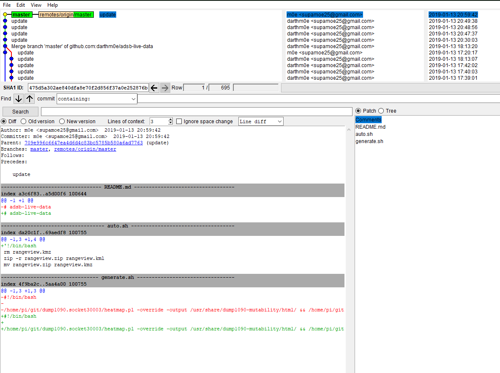

= Hitchhikers Guide to GIT

-- eine kurze Reise durchs GIT-Universum

` Work in Progress ! ||| Made by m0e@2019  --- E42L`

[TOC]

== Hilfreiche Links vorab:
https://git-scm.com/book/de/v1/[Offizielles GIT Buch] -- Sehr gut, mehrsprachig

https://rogerdudler.github.io/git-guide/index.de.html[Tutorial - kein SchnickSchnack] -- kurz und knackig

https://www.thewebhatesme.com/entwicklung/git-fuer-einsteiger/[Git für Einsteiger]

https://try.github.io/[Github Playground] -- inkteraktive Spielwiese

http://think-like-a-git.net/[Think like (a) GIT]

http://git.enigma42.de/m0e/GIT-Tut[Daten diese Tutorials] -- Repo des Tutorials

https://github.com/darthm0e/Test-GIT-TUT[Tutorial Repo] -- Das Beispielrepository

---


== Grundlegende Befehle:
----
git init

git add . || git add <filename>

git commit -m "grund" || git commit -a -m "grund"

git remote add origin http://pfad.zum/repo.git

git push -u origin master (master ist hier der Name des Branch, also hier der Hauptbranch)

git clone url (opt. lokalesVerzeichniss)

git clone --recursive
----
<<<


## Grundlagen

GIT ist ein relativ neues VCS (Version-Controll-System), welches im Unterschied zu vielen anderen Änderungen an Dateien und Ordnern nicht als Diffs (fortlaufende Liste der Änderung an Dateien) sondern erzeugt bei einem Commit einen Snapshot des Repository-*"Dateisystems"*
Hierbei werden effizienter weise nur geänderte Dateien neu gespeichert. Auf unveränderte Dateien wird nur ein Verweis auf den jeweiligen Snapshot angelegt. Dieses Konzept vereinfacht unter anderem die Arbeit mit Branches (*Grundlagen > Branching*).


Lokal wird mit `git init` ein Repository erzeugt, und der Ordner `.git` angelegt. Hier liegen Konfigurationsdateien des Repositorys und weiter Daten (für uns hier unrelevant).
In der Regel wird man ein Verzeichnis wählen das bereits Daten enthält. Um diese dem Repository bekannt zu machen (einchecken) führen wir den Befehl `git add .` aus. Hiermit werden alle im Verzeichnis enthaltenen Dateien und Ordner ins Repository aufgenommen. Um nur bestimmte Dateien oder Ordner aufzunehmen kann man statt des Punktes den Datei-/Ordnernamen angeben. Möglich ist auch die Angabe in Form von "Wildcards" um etwa alle Dateien eines Typs auzunehmen -> `git add *.png` oder `git add GenialeDateien.*`

```
~Screendump:~

$ git init
Initialized empty Git repository in /mnt/c/Users/m0e/Documents/GIT/Test-GIT-TUT/.git/

$ git add *.md
```

Unsere Dateien wurden jetzt zur Versionskontrolle (Staging Area) hinzugefügt, im Git Jargon `staged` oder `staging` genannt.
mit `git status` zeigt uns GIT diesen Zustand auch an:
```
~Screendump:~

$ git status
On branch master

Initial commit

Changes to be committed:
  (use "git rm --cached <file>..." to unstage)

        new file:   README.md
        new file:   Test.md

```

Nachdem nun alle Dateien in der Staging Area gesammelt sind können wir einen Commit ausführen und die Dateien zum Repository hinzufügen.
`git commit` öffnet den Standard Texteditor mit einer ähnlichen Meldung:

```
  GNU nano 2.7.4           File: /mnt/c/Users/m0e/Documents/GIT/Test-GIT-TUT/.git/COMMIT_EDITMSG                     

# Please enter the commit message for your changes. Lines starting
# with '#' will be ignored, and an empty message aborts the commit.
# On branch master
#
# Initial commit
#
# Changes to be committed:
#       new file:   README.md
#       new file:   Test.md
#
```
hier kann man noch weiter Kommentare einfügen, i.d.R. wird man die vorhanden Kommentare lassen, welches die Ausgabe von `git status` enthält. Hierdurch erkennt man besser was genau mit dem Commit geändert wurde. Gibt man zusätzlich den Schalter -v mit an wird noch ein DateiDiff der Commitmeldung hinzugefügt.

Bei kleinen Änderungen kann die Commit Nachricht auch direkt im BEfehl mitgegeben werden 
```
$ git commit -m "Schneller Commit, kleine Bugfixes"
[master (root-commit) f99b0dd] Schneller Commit, kleine Bugfixes
 2 files changed, 4 insertions(+)
 create mode 100644 README.md
 create mode 100644 Test.md
```

Die Ausgabe darunter teilt uns nun mit das der Commit erfolgreich dem `master Branch` hinzugefügt wurde, die SHA-1 Checksumme *(f99b0dd)*, die Commitmeldung, die geänderten Dateien und eine Angabe über die hinzugefügten oder entfernten Zeilen.

Für Dateien die bereits mit `git add` hinzugefügt wurden kann man später das Staging überspringen.
```
$ git commit -a -m "Schneller Commit, kleine Bugfixes, OHNE Staging"
[master f205c80] Schneller Commit, kleine Bugfixes, OHNE Staging
 1 file changed, 3 insertions(+)
```

Normalerweise wird man im Umgang mit GIT einen Zentralen Server wie Github, Gitlab, Bitbucket oder selbsteghostet benutzen. Um unserem Lokalen Repository diesen Server bekannt zu machen führen wir den folgenden Befehl aus:
`git remote add origin https://github.com/darthm0e/Test-GIT-TUT.git`
Im Beispiel wird das **Vorher** angelegte Repository [Test-GIT-TUT](https://github.com/darthm0e/Test-GIT-TUT) auf [Github](http://www.github.com) benutzt. 

Wenn wir jetzt `git push -u origin master` ausführen werden unsere Daten des Commits auf den Remote Server (origin, Name wählbar) in den Master-Branch geladen. Hiermit können auch weiter Server oder Branches hinzugefügt werden.
`git push -u developer nightly` würde die Daten auf einen mit `git remote` als Developer in die *Nightly-Branch* laden.

```
$ git push -u origin master
Username for 'https://github.com': supamoe25@gmail.com
Password for 'https://supamoe25@gmail.com@github.com':
Counting objects: 7, done.
Delta compression using up to 8 threads.
Compressing objects: 100% (4/4), done.
Writing objects: 100% (7/7), 612 bytes | 0 bytes/s, done.
Total 7 (delta 0), reused 0 (delta 0)
To https://github.com/darthm0e/Test-GIT-TUT.git
 * [new branch]      master -> master
Branch master set up to track remote branch master from origin.
```

Gibt man nun jemandem den Link zum Repository, kann sich dieser den Inhalt anschauen, auf seinen Rechner laden, bearbeiten, änderungen hochladen (schreibrechte vorrausgesetzt) etc.

`git clone <link>` oder `git clone --recursive <link>`

lädt das Repository in einen Unterordner(Name des Repo) ins aktuelle Verzeichniss.
```
$ git clone https://github.com/darthm0e/Test-GIT-TUT.git
Cloning into 'Test-GIT-TUT'...
remote: Enumerating objects: 7, done.
remote: Counting objects: 100% (7/7), done.
remote: Compressing objects: 100% (4/4), done.
remote: Total 7 (delta 0), reused 7 (delta 0), pack-reused 0
Unpacking objects: 100% (7/7), done.
```

Mit `git log` bzw `git log -p` kann man sich alle Commits bzw alle Commits mit änderungen anzeigen lassen:
```
$ git log

commit f205c80841f3b37957101285fc6af5b1691cc81d
Author: m0e <supamoe25@gmail.com>
Date:   Sat Jan 19 16:01:40 2019 +0100

    Schneller Commit, kleine Bugfixes, OHNE Staging

commit f99b0dd5b53a0f66e893bf6cd269eca779851082
Author: m0e <supamoe25@gmail.com>
Date:   Sat Jan 19 15:55:32 2019 +0100

    Schneller Commit, kleine Bugfixes
(END)
```
```
git log -p

commit f205c80841f3b37957101285fc6af5b1691cc81d
Author: m0e <supamoe25@gmail.com>
Date:   Sat Jan 19 16:01:40 2019 +0100

    Schneller Commit, kleine Bugfixes, OHNE Staging

diff --git a/Test.md b/Test.md
index 980a0d5..d6baa93 100644
--- a/Test.md
+++ b/Test.md
@@ -1 +1,4 @@
 Hello World!
+
+
+Was hinzugef<C3><BC>gt

commit f99b0dd5b53a0f66e893bf6cd269eca779851082
Author: m0e <supamoe25@gmail.com>
Date:   Sat Jan 19 15:55:32 2019 +0100

    Schneller Commit, kleine Bugfixes

diff --git a/README.md b/README.md
new file mode 100644
index 0000000..8829e9f
--- /dev/null
+++ b/README.md
@@ -0,0 +1,3 @@
+Hello World !
+
+Daten fuers GIT Tut
diff --git a/Test.md b/Test.md
new file mode 100644
index 0000000..980a0d5
--- /dev/null
+++ b/Test.md
@@ -0,0 +1 @@
+Hello World!
(END)
```

Eine Übersicht über die vorhandenen Remote Repositorys gibt `git remote -v`

```
$ git remote -v
origin  https://github.com/darthm0e/Test-GIT-TUT.git (fetch)
origin  https://github.com/darthm0e/Test-GIT-TUT.git (push)
```

Um die aktuellsten Änderungen ins lokale Repository zu übertragen führt man `git pull` aus. GIT versucht die neuen Commits aus dem Remote Repository zu holen und mit den lokalen Dateien zusammenzuführen.


### Branching


git branch "branchname"						->		Branch erstellen

git checkout "branchname"					->		Zum Branch wechseln

git push --set-upstream origin "branchname"	->		Branch hochladen

git checkout master							->		Zurück zum master Branch

git merge "branchname"						->		branch einchecken

git branch -d "brnachname"					->		branch löschen

git push									->		hochladen


### Tags

In GIT (wie auch in anderen VersionControll-Systemen - VCS) können mit Hilfe von Tags wichtige Punkte in der Commit-Hitory markiert werden. Normalerweise werden hiermit ReleaseVersionen oder andere Meilensteine markiert.

Um sich die in einem Repository vorhandenn Tags anzeigen zu lassen wird `git tag` benutzt. Hiermit werden die Tags in alphabetischer Reihenfolge aufgelistet

```
$> git tag
0.1
help
testing
```
Um nur bestimmte Tags zu sehen kann man folgenden Befehl verwenden: `git tag -l 'v1.4.2'
`

GIT unterscheidet 2 Arten von Tags, einfache (engl. lightweight) und kommentierte (engl. annotated)
Ein normaler Tag ist lediglich ein Zeiger auf einen Commit. Der Tag bleibt mit dem Commit verbunden und wird auch von nachfolgenden Änderungen nicht beeinflusst.
Ein Kommentierter Tag wird als vollwertiges Objekt in GIT gespeichert (ähnlich Commit) und umfasst eine Checksumme, Namen des Verfassers, die eMail Adresse das Datum und sowie eine Tag Nachricht. Desweiteren kann solch ein Tag mit GPG signiert werden.


Um nur bestimmte Tags zu sehen kann man folgenden Befehl verwenden: `git tag -l 'v1.4.2'
`
git tag									->		Tags anzeigen

git tag -a v1.2.3 -m "Version 1.2.3"	->		Kommentierter Tag erstellen

git tag -s v1.5 -m 'my signed 1.5 tag'	->		Tag mit GPG signieren

git push origin --tags  				->		Tags in Repo pushen


## Aliase und Autovervollständigung

### Autocompletion
Um für GIT Befehle eine Autovervollständigung zu erhalten, läd man (hier für BASH) das Script unter: https://github.com/git/git/blob/master/contrib/completion/git-completion.bash[Git-completion.bash]
herunter, und fügt `source ~/git-completion.bash` zu .bashrc hinzu.

### Alias
-- coming soon --


## Reset lokal Repository

git fetch origin

git reset –hard origin/master


<<<

## Software (Windows oder MultiPlattform) ###

https://git-scm.com/download/win[GitBash & GitGUI]


https://www.sourcetreeapp.com/[SourceTree]

https://desktop.github.com/[Github Desktop]
image:img/gitDesktop.png[gitDesktop,width=512]

https://www.gitkraken.com/[Git Kraken]

https://git-fork.com/[Fork]

https://github.com/FabriceSalvaire/CodeReview/[CodeReview]

https://gitblade.com/[Git Blade]

---

## Häufiger Workflow

Während der Entwicklungsarbeit wird der Workflow meistens in etwa so aussehen:

- Aktuellen master-Branch vom Server downloaden (vorher mit git status sicherstellen, dass man sich auf dem master-Branch befindet. Wenn nicht: git checkout master):
    `#> git pull`
- Einen neuen Branch für das kommende Feature anlegen:
    `#> git checkout -b meinfeature master`
- [Änderungen am Code durchführen]
- Geänderte und neue Dateien stagen:
    `#> git add .`
- Änderungen committen:
    `#> git commit -m "Changes xyz"`
- Jetzt den Branch auf den Server laden, wenn gewünscht:
    `#> git push -u origin meinfeature`
- … oder direkt in dem master wechseln:
    `#> git checkout master`
- (nochmals aktuellen Code ziehen - zur Sicherheit)
    `#> git pull`
- Eigenen Code mit master zusammenführen:
    `#> git merge meinfeature`
- Nicht mehr benötigten Branch löschen:
    `#> git branch -d meinfeature`
- Aktualisierten master auf den Server pushen:
    `#> git push`


- Fertig

## weitere Befehle ### 

`git stat`

`git diff`

`git fetch`

`git mv`

`git show`

`git remote show origin`

`git remote rm <name>`

`git rebase`

---

*~ Made by m0e@2019  --- enigma42Labs ~*
